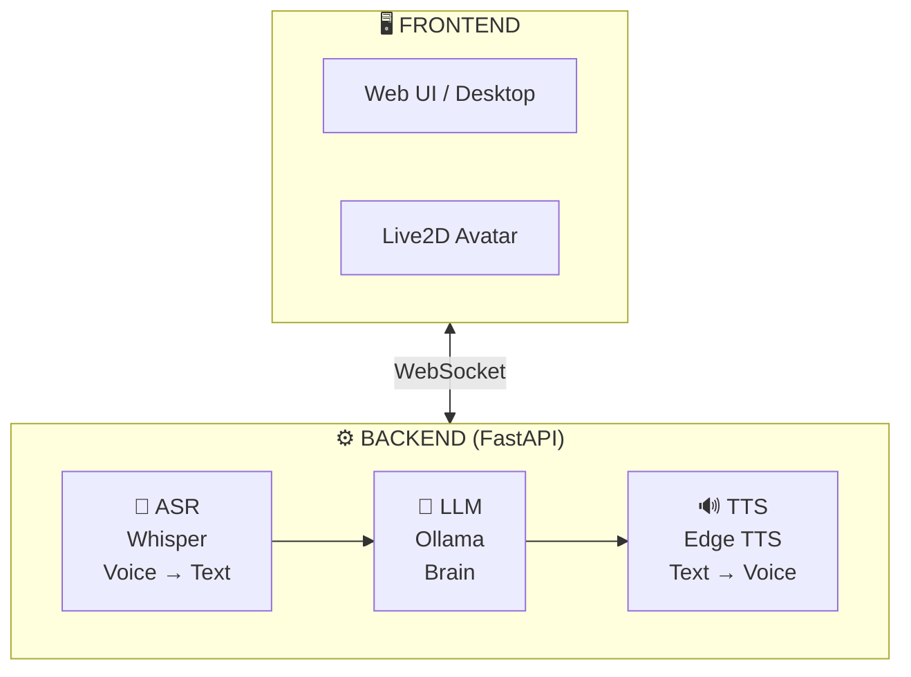

# 🤖 Local AI Companion

<p align="center">
  
</p>

<p align="center">
  <strong>An interactive voice AI assistant with Live2D avatar, built from scratch for learning.</strong>
</p>

<p align="center">
  <a href="#-features">Features</a> •
  <a href="#-architecture">Architecture</a> •
  <a href="#-installation">Installation</a> •
  <a href="#-roadmap">Roadmap</a> •
  <a href="#-what-i-learned">What I Learned</a>
</p>

---

## 🎯 About

This project is a **100% local and private AI assistant** capable of:
- 🔒 **Fully offline** - No cloud, no data sent anywhere
- 💬 Real-time conversation (text and voice)
- 🎤 Understanding your voice (Speech-to-Text)
- 🔊 Responding vocally (Text-to-Speech)
- 🎭 Animating via Live2D avatar (coming soon)
- 👁️ Seeing your screen to help you (coming soon)

### 🎓 Why this project?

Instead of forking an existing project, I chose to **rebuild from scratch** to:
- **Keep everything local** - No cloud APIs, your data stays on YOUR machine
- **Deeply understand** the architecture of an AI assistant
- **Master the concepts**: async Python, WebSockets, local LLMs, TTS, ASR
- **Demonstrate my skills** in software development and AI Engineering

> 💡 Inspired by [Open-LLM-VTuber](https://github.com/Open-LLM-VTuber/Open-LLM-VTuber), but entirely rewritten for learning purposes.

---

## ✨ Features

### Implemented ✅
- [x] **Local LLM module** - Ollama support (runs 100% on your machine)
- [x] **Privacy-first** - Your conversations never leave your computer
- [x] **Response streaming** - Real-time display of generation
- [x] **YAML configuration** - Personality and settings without touching code
- [x] **CLI Chatbot** - Functional command-line interface

### In Development 🚧
- [ ] **Text-to-Speech (TTS)** - Voice synthesis with Edge TTS
- [ ] **Speech-to-Text (ASR)** - Voice recognition with Whisper
- [ ] **Web Interface** - Frontend with WebSocket
- [ ] **Live2D Avatar** - Animation synchronized with voice

### Planned 📋
- [ ] **Vision** - Screen capture, camera input for visual understanding
- [ ] **Document RAG** - Query and understand your local documents
- [ ] **Persistent memory** - Long-term conversation history
- [ ] **PC Control** - Execute actions on your computer (open apps, search, etc.)
- [ ] **Desktop Pet mode** - Transparent widget always on screen

---

## 🏗️ Architecture



### Design Principles

| Principle | Description |
|-----------|-------------|
| **Abstraction** | Each module (LLM, TTS, ASR) implements an abstract interface |
| **Modularity** | Easily switch between different local models |
| **Async-first** | Using `async/await` for performance and streaming |
| **External config** | YAML to separate code from configuration |
---

## 📁 Project Structure

```
Local-AI-Companion/
├── src/
│   ├── llm/                 # Large Language Model module
│   │   ├── base.py          # Abstract interface BaseLLM
│   │   └── ollama_llm.py    # Ollama implementation
│   ├── tts/                 # Text-to-Speech module (coming)
│   ├── asr/                 # Speech Recognition module (coming)
│   └── core/                # Core logic
├── config/
│   └── config.yaml          # Configuration (model, personality)
├── frontend/                # User interface (coming)
├── main.py                  # CLI entry point
├── requirements.txt
└── README.md
```

---

## 🚀 Installation

### Prerequisites
- Python 3.11+
- [Ollama](https://ollama.com/) installed and running
- GPU recommended (but works on CPU)

### Setup

```bash
# Clone the repository
git clone https://github.com/LiiLk/Local-AI-Companion.git
cd Local-AI-Companion

# Create virtual environment
python3 -m venv venv
source venv/bin/activate  # Linux/Mac
# or: venv\Scripts\activate  # Windows

# Install dependencies
pip install -r requirements.txt

# Download an Ollama model
#Example
ollama pull llama3.2:3b
```

### Usage

```bash
# Run the CLI chatbot
python main.py
```

---

## 🛠️ Tech Stack

| Category | Technologies |
|----------|--------------|
| **Language** | Python 3.12 |
| **LLM** | Ollama (Llama, Mistral, Gemma...) - 100% local |
| **TTS** | Edge TTS (planned) |
| **ASR** | Faster-Whisper (planned) |
| **Backend** | FastAPI + WebSockets (planned) |
| **Frontend** | HTML/CSS/JS + PixiJS for Live2D (planned) |
| **HTTP Client** | httpx (async) |
| **Configuration** | PyYAML |

---

## 📚 What I Learned

This project allowed me to deepen my knowledge in:

### Advanced Python
- **Abstract Base Classes (ABC)** - Pattern for extensibility
- **Asynchronous programming** - `async/await`, `AsyncGenerator`
- **Type hints** - Self-documenting and IDE-friendly code
- **Dataclasses** - Clean data structures

### Software Architecture
- **SOLID principles** - Especially Dependency Inversion
- **Design patterns** - Factory, Strategy (for providers)
- **Separation of concerns** - Config/Code/Interface

### AI & APIs
- **LLM APIs** - Message format, streaming, tokens
- **Prompt engineering** - System prompts, personality
- **Audio pipelines** - ASR → LLM → TTS (coming)

---

## 📈 Roadmap

```
Phase 1: Foundations         ████████░░░░ 60%
├── ✅ Modular architecture
├── ✅ LLM Module (Ollama)
├── ✅ CLI Chatbot
├── 🔄 TTS Module
└── ⬜ ASR Module

Phase 2: Interface           ░░░░░░░░░░░░ 0%
├── ⬜ WebSocket Server
├── ⬜ Web Frontend
└── ⬜ Live2D Avatar

Phase 3: Advanced Features   ░░░░░░░░░░░░ 0%
├── ⬜ Vision (screen/camera)
├── ⬜ Persistent Memory
└── ⬜ PC Control
```

---

## 🙏 Acknowledgments & Inspirations

- [Open-LLM-VTuber](https://github.com/Open-LLM-VTuber/Open-LLM-VTuber) - Main architecture inspiration
- [Ollama](https://ollama.com/) - Easy-to-use local LLM
- [Edge TTS](https://github.com/rany2/edge-tts) - Free and quality TTS

---

## 📝 License

MIT License - See [LICENSE](LICENSE)

---

<p align="center">
  <i>Built with ❤️ to learn and share</i>
</p>
