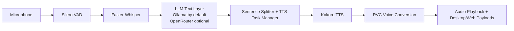

# Local AI Companion

<p align="center">
  
</p>

<p align="center">
  <strong>Offline-first desktop AI companion with Live2D, realtime voice conversation, and a pragmatic local voice pipeline.</strong>
</p>

<p align="center">
  <a href="#current-state">Current State</a> •
  <a href="#architecture">Architecture</a> •
  <a href="#quick-start">Quick Start</a> •
  <a href="#configuration">Configuration</a> •
  <a href="#entry-points">Entry Points</a> •
  <a href="#testing">Testing</a>
</p>

---

## Current State

`Local AI Companion` is a Windows-first AI assistant project built around one main goal: a responsive local voice companion with a Live2D shell and a maintainable backend.

The current stable path on `main` is:

```text
Microphone -> Silero VAD -> Faster-Whisper -> LLM text -> Kokoro TTS -> RVC -> Audio playback
```

### What this repository is today

- An **offline-first** assistant: ASR and TTS are local by default.
- A **desktop companion** with Live2D shell support.
- A **pipeline-first** architecture with explicit runtime ownership and test coverage.
- A project that can run with a **local LLM** by default (`Ollama`) or an **optional cloud LLM** (`OpenRouter`) when you choose to enable it.

### What is considered stable right now

- `mode: "pipeline"`
- `ASR: faster-whisper`
- `LLM: Ollama` by default, `OpenRouter` optional
- `TTS: Kokoro`
- `Voice conversion: RVC`
- Desktop overlay + WebSocket backend + CLI entry points

### What is not the primary production path

These remain supported or experimental, but they are not the default architecture we optimize around:

- `Qwen3-TTS` as premium local TTS path
- `Qwen3-ASR`
- `mode: "omni"` (MiniCPM-o)
- `mode: "gemma-omni"`
- `Chatterbox` and `Edge TTS` as secondary/fallback providers

---

## Why This Project Exists

This repository started as a from-scratch rebuild to understand and own the whole assistant stack instead of forking a monolithic VTuber project.

The project priorities are now clear:

- Keep the **main path simple and debuggable**
- Favor **one stable architecture** over many half-working ones
- Optimize for **single-GPU desktop reality**
- Stay **config-driven** and easy to iterate on
- Keep room for advanced paths without polluting the default runtime

Inspired by [Open-LLM-VTuber](https://github.com/Open-LLM-VTuber/Open-LLM-VTuber), but implemented here with a smaller and more opinionated architecture.

---

## Features

### Implemented

- Realtime voice pipeline with sentence-level streaming
- Local ASR with `faster-whisper`
- Local TTS with `Kokoro`
- Local voice conversion with `RVC`
- Live2D desktop companion backend
- Browser/WebSocket server for frontend integration
- Character presets in YAML
- Local config overrides via `config/config.local.yaml`
- Runtime lifecycle management for preload, warmup, cleanup, and degraded state handling
- Test suite covering pipeline, TTS routing, RVC, websocket flows, config loading, and language strategy

### Available but secondary

- `OpenRouter` LLM provider
- `Gemma` text+vision pipeline
- `MiniCPM-o` omni mode
- `Qwen3-TTS` worker-based local premium TTS path
- `Chatterbox` multilingual ONNX TTS
- `Edge TTS` cloud fallback

### Planned / active improvement areas

- Better ASR quality on the stable path (`Whisper large-v3` / `large-v3-turbo` evaluation)
- Better March 7th voice fidelity on the `Kokoro -> RVC` path
- Further codebase cleanup around the single stable architecture
- Stronger desktop UX and Live2D polish
- Vision and multimodal workflows once the voice core is settled

---

## Architecture

### Stable Reference Pipeline


```mermaid
flowchart LR
    Mic["Microphone"] --> VAD["Silero VAD"]
    VAD --> ASR["Faster-Whisper"]
    ASR --> LLM["LLM Text Layer\nOllama by default\nOpenRouter optional"]
    LLM --> Splitter["Sentence Splitter + TTS Task Manager"]
    Splitter --> TTS["Kokoro TTS"]
    TTS --> RVC["RVC Voice Conversion"]
    RVC --> Audio["Audio Playback + Desktop/Web Payloads"]
```

### Runtime Principles

| Principle | Meaning |
|---|---|
| `pipeline` is the default | The separate ASR -> LLM -> TTS stack is the main product path |
| One CUDA-heavy TTS path at a time | Sequential synthesis to stay safe on a single GPU |
| Config-driven | Behavior lives in `config/config.yaml` and `config/config.local.yaml` |
| Explicit lifecycle | Preload, warmup, cleanup, degraded state, and timeouts are owned centrally |
| Optional advanced paths | `Qwen3`, `Gemma`, `MiniCPM-o` exist, but do not define the stable architecture |

### Runtime Modes

| Mode | Purpose | Status |
|---|---|---|
| `pipeline` | Separate ASR -> LLM -> TTS chain | Primary / stable |
| `omni` | MiniCPM-o single-model multimodal path | Secondary / experimental |
| `gemma-omni` | Gemma multimodal path with separate TTS | Secondary / experimental |

---

## Project Layout

```text
Local-AI-Companion/
├── config/
│   ├── config.yaml
│   ├── config.local.example.yaml
│   └── characters/
├── frontend/
│   ├── index.html
│   └── live2d/
├── resources/
│   └── voices/
├── scripts/
│   ├── install_rvc_windows.ps1
│   ├── install_qwen3_tts_windows.ps1
│   ├── rvc_worker.py
│   ├── qwen3_tts_worker.py
│   └── benchmark / smoke test utilities
├── src/
│   ├── assistant/
│   │   ├── app.py
│   │   ├── conversation_pipeline.py
│   │   ├── audio_service.py
│   │   └── pipeline_runtime.py
│   ├── asr/
│   ├── llm/
│   ├── server/
│   ├── tts/
│   ├── utils/
│   └── vad/
├── tests/
├── main.py
└── run_assistant.py
```

### Key Files

| Area | Files |
|---|---|
| Desktop app | `run_assistant.py`, `src/assistant/app.py` |
| Voice pipeline | `src/assistant/conversation_pipeline.py`, `src/assistant/pipeline_runtime.py` |
| ASR | `src/asr/whisper_provider.py` |
| TTS | `src/tts/kokoro_provider.py`, `src/tts/rvc_provider.py`, `src/tts/tts_task_manager.py` |
| Optional premium TTS | `src/tts/qwen3_tts_provider.py` |
| WebSocket server | `src/server/app.py`, `src/server/websocket.py` |
| Character system | `config/characters/*.yaml` |
| Core config | `config/config.yaml`, `config/config.local.yaml` |

---

## Quick Start

### 1. Prerequisites

- Windows 11 is the primary target
- Python 3.11+
- NVIDIA GPU recommended for the intended desktop experience
- `ffplay` or `mpv` if you want local audio playback from the CLI path
- [Ollama](https://ollama.com/) if you want the default local LLM path

### 2. Clone and install Python dependencies

```powershell
git clone https://github.com/LiiLk/Local-AI-Companion.git
cd Local-AI-Companion

python -m venv venv
venv\Scripts\activate
pip install -r requirements.txt
```

### 3. Configure local overrides

```powershell
copy config\config.local.example.yaml config\config.local.yaml
```

Use `config/config.local.yaml` for:

- secrets such as `OPENROUTER_API_KEY`
- machine-specific paths
- local experiments you do not want to commit

### 4. Set up the default LLM path

#### Option A: local LLM with Ollama (default)

```powershell
ollama pull qwen3.5:4b
```

Make sure Ollama is running on `http://localhost:11434`.

#### Option B: OpenRouter (optional)

Set `OPENROUTER_API_KEY` in your environment or in `config/config.local.yaml`, then switch:

```yaml
llm:
  provider: "openrouter"
```

### 5. Install the default voice conversion worker

The stable voice path on `main` uses `Kokoro -> RVC`, so install the RVC worker once:

```powershell
powershell -ExecutionPolicy Bypass -File scripts/install_rvc_windows.ps1
```

If you want a plain Kokoro path first, you can temporarily disable RVC:

```yaml
tts:
  rvc:
    enabled: false
```

### 6. Run the app

#### Desktop companion

```powershell
python run_assistant.py
```

#### Desktop backend only (bridge mode for Tauri / external shell)

```powershell
python run_assistant.py --bridge-server --bridge-port 8765
```

#### Browser / WebSocket server

```powershell
python -m src.server
```

Then open `http://localhost:8000`.

#### CLI chatbot

```powershell
python main.py
python main.py --voice
python main.py --voice --listen
```

---

## Configuration

The repository is intentionally config-driven.

### Config files

- Tracked defaults: `config/config.yaml`
- Local overrides: `config/config.local.example.yaml`
- Character presets: `config/characters/*.yaml`

All main entry points now load config through the shared config loader, so `config.local.yaml` overrides are applied consistently.

### Important settings

```yaml
mode: "pipeline"

pipeline:
  reply_language: "en"

llm:
  provider: "ollama"   # or "openrouter", "gemma"

tts:
  provider: "kokoro"
  warmup_on_start: true
  rvc:
    enabled: true

asr:
  provider: "whisper"
  model_size: "small"
  device: "cuda"
```

### Character presets

The current default preset is `march7th`.

Relevant assets already wired in the repo:

- Live2D model under `assets/models/march7th/`
- RVC files under `resources/voices/march7th/`
- reference audio for premium voice paths under `resources/voices/march7th/`

---

## Entry Points

| Command | Purpose |
|---|---|
| `python run_assistant.py` | Desktop Live2D assistant |
| `python run_assistant.py --bridge-server` | Desktop backend without pywebview, websocket bridge mode |
| `python -m src.server` | FastAPI + WebSocket server for browser frontend |
| `python main.py` | CLI chatbot |
| `python main.py --voice --listen` | CLI voice conversation path |

---

## Optional Advanced Providers

These are intentionally not part of the primary README quick path, but they still exist in the codebase.

### Qwen3-TTS

For the worker-based Qwen3 premium path:

```powershell
powershell -ExecutionPolicy Bypass -File scripts/install_qwen3_tts_windows.ps1
```

Then switch config:

```yaml
tts:
  provider: "qwen3"
```

This path is useful for experimentation and premium local voice cloning, but it is not the default stable path on `main`.

### Gemma / MiniCPM-o

Both multimodal paths are available in the codebase, but they are secondary modes and should be treated as such:

```yaml
mode: "omni"
# or
mode: "gemma-omni"
```

---

## Testing

Run the full repository test suite:

```bash
pytest tests -q
```

Run a specific file:

```bash
pytest tests/test_pipeline_runtime.py -q
pytest tests/test_conversation_pipeline_rvc.py -q
pytest tests/test_websocket_openrouter.py -q
```

There are also utility scripts in `scripts/` for smoke tests, latency profiling, and provider benchmarking.

---

## Known Constraints

- The project is optimized for **single-GPU desktop usage**, so heavyweight providers should not all be enabled blindly.
- The default stable ASR is still `whisper small`; higher-accuracy upgrades are planned but not the current default.
- `Qwen3-TTS`, `Qwen3-ASR`, `Gemma`, and `MiniCPM-o` are not the baseline that the repository is currently simplified around.
- Windows is the primary target; some advanced runtimes may behave differently on Linux/WSL.

---

## Roadmap

### Near term

- Improve ASR quality on the stable path
- Improve March 7th voice fidelity on `Kokoro -> RVC`
- Continue removing dead code and old architecture leftovers
- Tighten desktop UX and preload behavior

### Later

- Stronger multimodal workflows
- Better screen understanding and vision
- Memory and long-term personalization
- More polished Live2D and desktop-pet behavior

---

## Acknowledgments

- [Open-LLM-VTuber](https://github.com/Open-LLM-VTuber/Open-LLM-VTuber)
- [Ollama](https://ollama.com/)
- [OpenRouter](https://openrouter.ai/)
- [Kokoro](https://github.com/hexgrad/kokoro)
- [RVC](https://github.com/RVC-Project/Retrieval-based-Voice-Conversion-WebUI)
- [Faster-Whisper](https://github.com/SYSTRAN/faster-whisper)
- [Silero VAD](https://github.com/snakers4/silero-vad)
- [Live2D Cubism SDK](https://www.live2d.com/en/sdk/)

---

## License

MIT. See [LICENSE](LICENSE).
