# 🤖 Local AI Companion

<p align="center">
  
</p>

<p align="center">
  <strong>An interactive voice AI assistant with Live2D avatar, built from scratch for learning.</strong>
</p>

<p align="center">
  <a href="#-features">Features</a> •
  <a href="#-architecture">Architecture</a> •
  <a href="#-installation">Installation</a> •
  <a href="#-roadmap">Roadmap</a> •
  <a href="#-what-i-learned">What I Learned</a>
</p>

---

## 🎯 About

This project is a **100% local and private AI assistant** capable of:
- 🔒 **Fully offline** - No cloud, no data sent anywhere
- 💬 Real-time conversation (text and voice)
- 🎤 Understanding your voice (Speech-to-Text)
- 🔊 Responding vocally (Text-to-Speech)
- 🎭 Animating via Live2D avatar (coming soon)
- 👁️ Seeing your screen to help you (coming soon)

### 🎓 Why this project?

Instead of forking an existing project, I chose to **rebuild from scratch** to:
- **Keep everything local** - No cloud APIs, your data stays on YOUR machine
- **Deeply understand** the architecture of an AI assistant
- **Master the concepts**: async Python, WebSockets, local LLMs, TTS, ASR
- **Demonstrate my skills** in software development and AI Engineering

> 💡 Inspired by [Open-LLM-VTuber](https://github.com/Open-LLM-VTuber/Open-LLM-VTuber), but entirely rewritten for learning purposes.

---

## ✨ Features

### Implemented ✅
- [x] **Local LLM module** - Multiple providers, runs 100% on your machine
  - 🦙 **llama.cpp** (Jan-v2-VL-high) - 8B vision-language "thinking" model
  - 🦣 **Ollama** - Easy-to-use with pre-packaged models
- [x] **Privacy-first** - Your conversations never leave your computer
- [x] **Response streaming** - Real-time display of generation
- [x] **YAML configuration** - Personality and settings without touching code
- [x] **CLI Chatbot** - Functional command-line interface
- [x] **Text-to-Speech (TTS)** - Voice synthesis with:
  - 🔊 **Kokoro TTS** (local, 82M params, high quality) - *Recommended*
  - 🌐 **Edge TTS** (cloud fallback, Microsoft voices)

- [x] **Speech-to-Text (ASR)** - Voice recognition with:
  - 🦜 **NVIDIA Parakeet TDT** (0.6B, fast, 25 languages) - *Recommended*
  - 🎤 **Faster-Whisper** (local, multiple model sizes)
  - 🐤 **NVIDIA Canary** (1B, state-of-the-art accuracy)
- [x] **Full Voice Conversation** - Speak to the AI, hear its response!
- [x] **Web Interface** - Frontend with real-time WebSocket communication
- [x] **Voice Activity Detection** - Silero VAD for automatic speech detection

### In Development 🚧
- [ ] **Live2D Avatar** - Animation synchronized with voice

### Planned 📋
- [ ] **Voice Cloning** - Clone any voice with XTTS v2
- [ ] **Vision** - Screen capture, camera input for visual understanding
- [ ] **Document RAG** - Query and understand your local documents
- [ ] **Persistent memory** - Long-term conversation history
- [ ] **PC Control** - Execute actions on your computer (open apps, search, etc.)
- [ ] **Desktop Pet mode** - Transparent widget always on screen

---

## 🏗️ Architecture

```mermaid
flowchart TB
    subgraph Frontend["🖥️ FRONTEND"]
        UI["Web UI / Desktop"]
        Live2D["Live2D Avatar"]
    end
    
    subgraph Backend["⚙️ BACKEND (FastAPI)"]
        ASR["🎤 ASR<br/>Whisper<br/>Voice → Text"]
        LLM["🧠 LLM<br/>Ollama<br/>Brain"]
        TTS["🔊 TTS<br/>Kokoro/Edge<br/>Text → Voice"]
    end
    
    Frontend <-->|WebSocket| Backend
    ASR --> LLM --> TTS
```



### Design Principles

| Principle | Description |
|-----------|-------------|
| **Abstraction** | Each module (LLM, TTS, ASR) implements an abstract interface |
| **Modularity** | Easily switch between different local models |
| **Async-first** | Using `async/await` for performance and streaming |
| **External config** | YAML to separate code from configuration |
---

## 📁 Project Structure

```
Local-AI-Companion/
├── src/
│   ├── llm/                 # Large Language Model module
│   │   ├── base.py          # Abstract interface BaseLLM
│   │   └── ollama_llm.py    # Ollama implementation
│   ├── tts/                 # Text-to-Speech module
│   │   ├── base.py          # Abstract interface BaseTTS
│   │   ├── edge_provider.py # Edge TTS (cloud)
│   │   └── kokoro_provider.py # Kokoro TTS (local)
│   ├── asr/                 # Speech Recognition module
│   │   ├── base.py          # Abstract interface BaseASR
│   │   └── whisper_provider.py # Whisper ASR (local)
│   └── core/                # Core logic
├── config/
│   └── config.yaml          # Configuration (model, personality)
├── frontend/                # User interface (coming)
├── main.py                  # CLI entry point
├── requirements.txt
└── README.md
```

---

## 🚀 Installation

### Prerequisites
- Python 3.11+
- GPU recommended (NVIDIA RTX for best performance)
- ~10GB disk space for models

### Setup

```bash
# Clone the repository
git clone https://github.com/LiiLk/Local-AI-Companion.git
cd Local-AI-Companion

# Create virtual environment
python3 -m venv venv
source venv/bin/activate  # Linux/Mac
# or: venv\Scripts\activate  # Windows

# Install dependencies
pip install -r requirements.txt
```

### LLM Setup (Choose one)

#### Option A: Jan-v2-VL-high (Recommended for vision tasks)
```bash
# 1. Download llama.cpp binaries
mkdir -p ~/tools/llama-cpp && cd ~/tools/llama-cpp
wget https://github.com/ggml-org/llama.cpp/releases/latest/download/llama-b7274-bin-ubuntu-vulkan-x64.tar.gz
tar -xzf llama-b7274-bin-ubuntu-vulkan-x64.tar.gz

# 2. Download the model (~5.8 GB total)
mkdir -p ~/models/jan-v2-vl-high && cd ~/models/jan-v2-vl-high
wget https://huggingface.co/janhq/Jan-v2-VL-high-gguf/resolve/main/Jan-v2-VL-high-Q4_K_M.gguf
wget https://huggingface.co/janhq/Jan-v2-VL-high-gguf/resolve/main/mmproj-Jan-v2-VL-high.gguf

# 3. Start the LLM server
./scripts/start_llm_server.sh --daemon
```

#### Option B: Ollama (Simpler setup)
```bash
# Install Ollama
curl -fsSL https://ollama.com/install.sh | sh

# Download a model
ollama pull llama3.2:3b

# Update config/config.yaml to use provider: "ollama"
```

### Usage

```bash
# Run the CLI chatbot (text only)
python main.py

# Run with voice output (Kokoro TTS - local)
python main.py --voice

# Run with Edge TTS (cloud)
python main.py --voice --tts edge

# Full voice conversation (speak + hear) 🎤🔊
python main.py --listen

# Start the web server
python -m src.server
# Then open http://localhost:8000 in your browser
```

---

## 🛠️ Tech Stack

| Category | Technologies |
|----------|--------------|
| **Language** | Python 3.12 |
| **LLM** | Jan-v2-VL-high (8B, vision) via llama.cpp + Ollama fallback |
| **TTS** | Kokoro (local, 82M params) + Edge TTS (cloud fallback) |
| **ASR** | NVIDIA Parakeet TDT (0.6B) + Faster-Whisper + Canary |
| **VAD** | Silero VAD (voice activity detection) |
| **Backend** | FastAPI + WebSockets |
| **Frontend** | HTML/CSS/JS vanilla |
| **HTTP Client** | httpx (async) |
| **Configuration** | PyYAML |

---

## 📚 What I Learned

This project allowed me to deepen my knowledge in:

### Advanced Python
- **Abstract Base Classes (ABC)** - Pattern for extensibility
- **Asynchronous programming** - `async/await`, `AsyncGenerator`
- **Type hints** - Self-documenting and IDE-friendly code
- **Dataclasses** - Clean data structures

### Software Architecture
- **SOLID principles** - Especially Dependency Inversion
- **Design patterns** - Factory, Strategy (for providers)
- **Separation of concerns** - Config/Code/Interface

### AI & APIs
- **LLM APIs** - Message format, streaming, tokens
- **Prompt engineering** - System prompts, personality
- **Audio pipelines** - ASR → LLM → TTS (coming)

---

## 📈 Roadmap

```
Phase 1: Foundations         ████████████████ 100% ✅
├── ✅ Modular architecture
├── ✅ LLM Module (Ollama + llama.cpp)
├── ✅ CLI Chatbot
├── ✅ TTS Module (Kokoro + Edge)
└── ✅ ASR Module (Whisper + Canary + Parakeet)

Phase 2: Web Interface       ████████████░░░░ 80%
├── ✅ WebSocket Server
├── ✅ Web Frontend
├── ✅ Voice Activity Detection (Silero VAD)
└── ⬜ Live2D Avatar

Phase 3: Advanced Features   ░░░░░░░░░░░░░░░░ 0%
├── ⬜ Voice Cloning (XTTS v2)
├── ⬜ Vision (screen/camera)
├── ⬜ Persistent Memory
└── ⬜ PC Control
```

---

## 🙏 Acknowledgments & Inspirations

- [Open-LLM-VTuber](https://github.com/Open-LLM-VTuber/Open-LLM-VTuber) - Main architecture inspiration
- [llama.cpp](https://github.com/ggml-org/llama.cpp) - Fast local inference with Vulkan/CUDA
- [Jan-v2-VL](https://huggingface.co/janhq/Jan-v2-VL-high-gguf) - Vision-language "thinking" model
- [Ollama](https://ollama.com/) - Easy-to-use local LLM
- [Kokoro TTS](https://github.com/hexgrad/kokoro) - High-quality local TTS (82M params)
- [Faster-Whisper](https://github.com/SYSTRAN/faster-whisper) - Fast local ASR (4x faster than original)
- [NVIDIA NeMo](https://github.com/NVIDIA/NeMo) - Canary and Parakeet ASR models
- [Edge TTS](https://github.com/rany2/edge-tts) - Free cloud TTS fallback

---

## 📝 License

MIT License - See [LICENSE](LICENSE)

---

<p align="center">
  <i>Built with ❤️ to learn and share</i>
</p>
